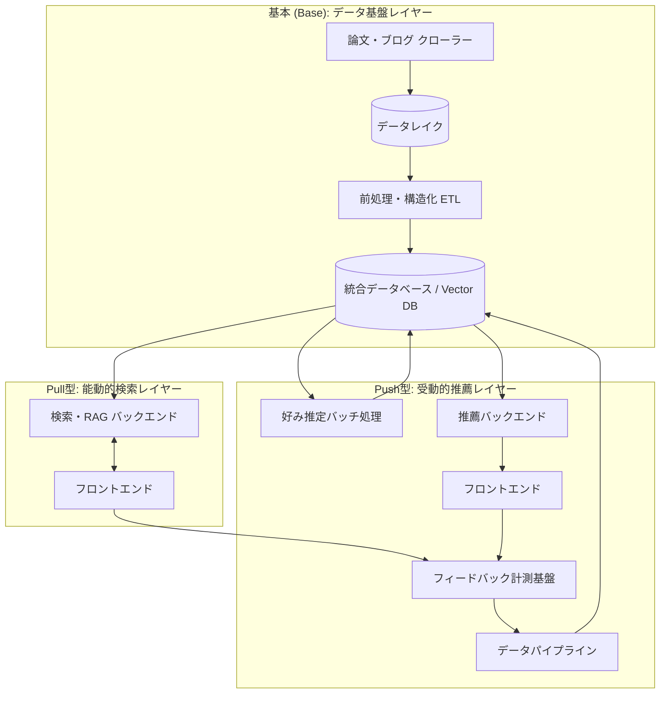

# Design Doc: DevGist

## 1. What: プロダクトコンセプト

「理論・実装・キャリアの分断を埋める、MLE/FDEのためのインテリジェンス・プラットフォーム」

Vision: エンジニアが「情報の海」で溺れる時間を減らし、「本質的な思考と意思決定」に集中できる世界を作る。

DevGistの立ち位置は、以下の3つの要素が重なる唯一の場所です。

* Scope: 全領域 (Science + Engineering + Career)
* Access: Push (推薦) + Pull (検索/回答)
* Data: Structured (構造化済みデータ)

## 2. Why: 解決する課題

「多岐にわたる専門情報が分断され、かつ非構造化であるため、知識の習得と統合にコストがかかりすぎる」

FDEやMLEは「研究者」「エンジニア」「組織人」の3つの帽子を使い分ける必要がありますが、情報環境はこれに対応できていません。

* 情報のサイロ化 (Silos): 理論はarXiv、実装はZenn/Qiita、キャリアはNote/Hatenaと情報源が分散しており、これらを横断して知識を統合するコストが高い。
* 「探す」コストの増大: 従来の検索（Google/Feedly）では「リンクのリスト」が返されるだけで、中身を読んで「要点（技術選定の理由や、実験結果）」を自分で抽出する必要がある。
* 未知へのアクセス欠如: 検索は「知っているキーワード」でしか行えないため、自分の専門領域外にある重要なトレンドや、異分野（例：採用市場の変化や新しいインフラ技術）の知見を取りこぼす。

## 3. コアソリューション (The Solution)

DevGistは、以下の3つの機能で「エンジニアの第2の脳」として機能します。

### ① 3層情報の集約と構造化 (Aggregation & Structuring)

世界中の情報を3つのレイヤーで収集し、LLMが「読む前に」中身を構造化してデータベース化します。

| レイヤー | 情報源 | LLMが抽出・構造化するもの |
| :---- | :---- | :---- |
| Science | arXiv, ACL | 課題・手法・SOTA達成の有無 |
| Engineering | Zenn, Qiita, Tech Blogs | 使用技術(Stack)・選定理由・ハマりどころ |
| Career | Note, Hatena, Corporate Blogs | 組織フェーズ・課題・解決策(Action) |

### ② 能動的な「知見」検索 (Active RAG Search)

* 体験: 「リスト（検索結果）」ではなく「答え（知見）」を返す。
* 例: 「RecSysのバイアス除去の最新トレンドは？」と聞くと、論文とテックブログを横断して要約し、「手法AとBが主流で、メルカリではAを採用しています」と回答する。

### ③ 受動的な「未知」の発見 (Passive Discovery)

* 体験: 検索しなくても、「今の自分に必要な情報」が届く。
* 例: ユーザーの興味ベクトル（Go, k8s, MLOps）を分析し、「あなたが興味を持ちそうな、新しい分散DBの論文が出ました」とプッシュ通知する。

## 4. 競合との差別化 (Differentiation)

| カテゴリ | 代表的なサービス | 特徴 | 特徴と限界 | DevGistの優位性 (Why DevGist?) |
| :---- | :---- | :---- | :---- | :---- |
| A. 論文特化 | AlphaXiv, Consensus | 論文特化 | Scienceのみ。 論文の要約や議論はできるが、「それをどう実装するか（Engineering）」や「組織での立ち回り（Career）」の情報がない。 | 実装とキャリアがある。 数式だけでなく、「どう作るか」「どうチームを動かすか」までカバーする。 |
| B. ニュース収集 | daily.dev, Feedly | ニュース一覧 | 受動的発見のみ。 「リスト」を出すだけで、中身の構造化（要約・抽出）がされていない。「答え」を得るにはリンクを踏んで全文を読む必要がある。 | 構造化と文脈がある。 単なるリンク集ではなく、読むべき理由（要点）が事前に提示される。 |
| C. 汎用AI検索 | Perplexity, Genspark | 検索AI | 能動的検索のみ。 質問すれば要約して回答してくれるが、「検索しないと情報が来ない」ため、新しい興味の開拓（受動的発見）ができない。また、ドメイン知識が浅い場合がある。 | 受動的発見がある。 検索窓に打ち込まなくても、セレンディピティ（偶然の発見）を提供する。 |

### 差別化要因 (The Gap & Winning Strategy)

DevGistは、上記サービスの「良いとこ取り」をしつつ、LLMによる「事前構造化」で独自の価値を生み出します。

① 「3層統合」のナレッジベース (Aggregation)

* 他社: 特定のドメイン（論文だけ、テックブログだけ）に閉じている。
* DevGist: Science (理論), Engineering (実装), Career (組織) を一箇所に集約。MLE/FDEに必要な「全方位のコンテキスト」を単一のタイムラインで提供する。

② 「リスト」ではなく「知見」を返す検索 (Answer-First Search)

* 他社: 検索結果として「URLのリスト」を表示する（Google, Feedly）。
* DevGist: 事前にLLMが抽出・構造化したデータをもとに、RAGで「要約された回答」を即座に提示する。「読む」時間を「理解する」時間に変える。

③ 「未知の既知」化するパーソナル推薦 (Context-Aware Discovery)

* 他社: 単なるキーワードマッチや、人気ランキングでの推薦。
* DevGist: ユーザーの興味ベクトル（例: Go, RecSys）を理解し、「検索はしていないが、興味を持ちそうな重要情報（論文・実装・キャリア論）」をプッシュ通知する。自分で検索する手間を省き、受動的に賢くなれる体験を提供する。

## 5. リスクと対策 (Risks & Mitigations)

本プロダクト（DevGist）の開発・運用において想定される主要なリスクと、それに対する具体的な緩和策（Mitigation Plan）を定義する。特に「競合優位性」「データ品質」「習慣化」「UX」の4点をクリティカルな課題として認識し、以下の通り対策を行う。

### 5.1. 競合優位性の欠如 (The "Perplexity" Risk)

リスク:

汎用的なAI検索エンジン（Perplexity, ChatGPT, Gemini等）の機能向上により、プロダクトの存在意義が失われるリスク。

ユーザーが「検索すれば済む」と考え、事前に構造化されたデータベースの価値を感じない可能性がある。

対策:

* ドメイン特化による「深さ」の確保:
  汎用検索では不可能な「MLE/FDE視点での構造化」を行う。LLMのプロンプトをチューニングし、一般的な要約ではなく「使用技術スタック」「評価指標（Metrics）」「アーキテクチャの選定理由」など、実務に必要な項目をピンポイントで抽出・データベース化する。
* 「検索（Pull）」と「発見（Push）」の統合:
  Perplexityは「能動的な検索」に特化しているが、DevGistは検索履歴（興味ベクトル）に基づいた「受動的な発見（フィード）」を提供する。ユーザーが言語化できていない潜在的な重要情報（未知の論文や他社の事例）をプッシュすることで差別化する。

### 5.2. データ品質の低下 (Garbage In, Garbage Out)

リスク:

テックブログ等の収集対象には「やってみた」レベルの初歩的な記事や、内容の薄い記事（ポエム）が大量に含まれる。これらを無差別にRAGに取り込むと、検索結果のS/N比（シグナル対ノイズ比）が悪化し、実務に耐えうる知見が得られない。

対策:

* 厳格なホワイトリスト運用:
  無差別なクローリングを行わず、arXivの特定カテゴリ、信頼性の高い企業テックブログ、一定以上のStar数を持つリポジトリ/記事にソースを限定する。
* LLMによる品質フィルタリング (Quality Gate):
  データ取り込み（Ingestion）パイプラインにおいて、LLMによる「品質判定」を実施する。「一次情報が含まれているか」「具体的な実装/検証結果があるか」をスコアリングし、低品質なコンテンツはDBへの保存前に破棄（Drop）する。

### 5.3. 習慣化の失敗 (Retention Risk)

リスク:

エンジニアは既にX (Twitter), Slack, GitHub等で情報収集を行っており、新しいアプリを開く動機が弱い。「いつ使うのか」が曖昧なままでは、初期登録後に離脱する可能性が高い。

対策:

* Phase 1: 「実務の道具」としての定着:
  初期は「暇つぶしのニュースアプリ」ではなく、「実務上の課題解決ツール（Private Perplexity）」として訴求する。エラー調査や技術選定時の「ググる」行為を代替し、業務フローに組み込むことで信頼を勝ち取る。
* Phase 2: パーソナライズによる再訪:
  実務で蓄積された検索ログ（興味関心データ）を教師データとして活用し、極めて精度の高いパーソナライズフィードを生成する。「自分の業務に直結する情報が届く」状態を作ることで、アプリを開く必然性を作る。

### 5.4. コンテキストの混在による認知負荷 (Context Mixing)

リスク:

「理論（論文）」「実装（ブログ）」「キャリア（組織論）」という性質の異なる情報を無秩序に提示すると、ユーザーの認知負荷が高まる（例：デバッグ中にキャリア論がレコメンドされる等）。結果として、どのユースケースでも使いにくい体験になる。

対策:

* モードの分離 (Mode Separation):
  「解決したい（Search）」モードと「広く知りたい（Feed）」モードをUX上で明確に分離する。検索時にはノイズとなるキャリア記事を除外し、フィード時のみ表示する等の制御を行う。
* 「緩やかな紐付け」へのシフト:
  論文とブログの厳密な1:1対応（直接的な引用関係）のみに依存せず、ベクトル検索による「意味的な関連性」での紐付けを行う。これにより、直接的な言及がなくとも「同じ理論を用いた実装事例」を柔軟に提示し、情報の断絶を埋める。

## 6. How: どうやって実現するか

### 1. データインジェクション & インテリジェンス・レイヤー（基本）

ここは「情報の海」から「構造化された知見」を生成する心臓部です。

* 自律型コレクター (Collector): arXiv API、Zenn/QiitaのRSS、ホワイトリスト化した企業テックブログを巡回するクローラー。
* Raw Data Lake: 取得したHTMLやXML、PDFをそのまま保存するストレージ（S3やローカルディスク）。後でパース方法やLLMのモデルを変更した際の再処理用。
* 構造化・品質評価エンジン (Intelligence Worker):
  * Quality Gate: LLMを用いて「実務に耐えうる一次情報か」を判定。
  * Semantic Parser: 記事を読み、技術スタック、解決した課題、数式モデルなどを構造化データ（JSON）として抽出。
* ハイブリッド・ナレッジベース (DB): メタデータ（SQL）と全文検索（BM25）、ベクトルデータ（Embedding）を統合して扱えるDB（PostgreSQL + pgvector、またはElasticsearch）。

### 2. セマンティック・リトリーバル・レイヤー（Pull型）

ユーザーの問いに対して、膨大なデータから最適な「答え」を導き出す層です。

* Query Orchestrator: ユーザーの自然言語クエリを、フィルタ条件（タグ、カテゴリ）とベクトル検索用のクエリに分解する。
* RAG Engine (Synthesizer): 検索結果（論文＋ブログ）をコンテキストとしてLLMに渡し、引用元付きの回答を生成するプロセッサ。
* Advanced Search Interface: キーワード検索、タグフィルタ、ベクトル類似度検索を組み合わせた「ハイブリッド検索」を提供するAPI。

### 3. パーソナライズ・フィードバック・レイヤー（Push型）

「探さなくても賢くなる」体験を支える、RecSys（推薦システム）の構成要素です。

* イベント・トラッキング・パイプライン: ユーザーがどの記事を読み、どの回答をブックマークしたかなどの行動ログを収集する基盤。
* 興味ベクトル・プロファイラー: 行動ログに基づき、ユーザーの現在の関心を「高次元ベクトル空間」上の座標として管理・更新するバッチ。
* パーソナライズ・ランカー: 新着記事のベクトルとユーザーの興味ベクトルの近接度を計算し、さらに「情報の新しさ」や「信頼性スコア」を重み付けしてフィードを生成するエンジン。

### 4. プロダクト・インターフェース

MLE/FDEが日常のワークフローの中で自然に使えるためのUIです。

* Unified Dashboard: 検索窓（Pull）と、最新の要約カードが並ぶフィード（Push）が統合されたインターフェース。
* Insight Card Viewer: 元の記事を開く前に、LLMが抽出した「技術スタック」「結論」「評価指標」を一目で確認できるビューワー。

### コンポーネント間の連携イメージ

実現方法をより具体化するために、これらのコンポーネントがどのようにデータをやり取りするか、以下の図をイメージしてください。

1. Ingestion: クローラーがデータを拾い、Data Lakeに放り込む。
2. Structuring: PythonワーカーがLLMを使って構造化し、DBにメタデータとベクトルを保存。
3. Search (Pull): ユーザーが質問すると、APIがDBを検索し、RAGで回答を合成してフロントへ返す。
4. Discovery (Push): バックグラウンドで行動ログを分析し、ユーザーの好みに合う新着情報をフィードにプッシュする。

この構成で進める際、特に「基本」部分のコレクターとPythonの境界線をどこに引くかが、開発効率を左右するポイントになります。データ処理のパイプライン（ETL）にメッセージキュー（Pubsubなど)を挟むことで、各コンポーネントを疎結合に保つのが理想的です。

### DevGist システムアーキテクチャ図

[Mermaid](https://mermaid.live/edit#pako:eNqVVP9P00AU_1cul2BGMua6zW40xoRRMCb7YVHiD3bGHNvBFrZ2aTsQCYlrjUAAxR8YEfFLFBEjggZJVCD8MZdu87_w7tpuFVmiTdO8e_d5n_c-7951Dua1AoYSnNRRtQjG5JwK6NPXB5zXP5tbe8Q6JDZ9XxL7hNir3F4EIRmZCNxQJ7FhljS13w0yauMuSw66wSCURgbulwCxF1i8dUb9rRfbxKa89Evfkxx0g9kzrKOZMtaV9qdGs0EjjondIPZnYn0BxDpgFiviI_3e7QaxUjJoCiuhThaP3zroD-BGxjKKs7TqLOy01h5T7uaH5V8P3zgrDbYT5EsrodbRV2dtMcD3nBs_wGVwG-dNTaconxurhZza6Vq2Vi47r5Z7tG0ob5amMbiFkZ4v_t01L1gCbfvUWV5vbT5qbm-1vr3t1S-GT48oPuj45tB12uo1YtusXdYuT7sU0Daqa6pJC76XVYi9zhvKCjsPPS_JKPaWlEWGwTTJJSOvTWN99iJZnEACztMNT9aT3XZjp5esUYwL4yg_xWu03vF8Sx1d7d3F5vc9d5DOjUG2VMVK4NSecfoNNjLMOAzAszqeSCMzX1Sc96ekfkYrcvY3vSR23Z2SIJ5qYK32Cv-XHsv_0eOBgYHuJSH1_eZRnVgrzB0ACZHulQOjZW3G3fFuDQVf61wGd8df8S065a6XGi42HeCORfg0BWjlNEe5M-a6XBtcZf7uKAVY4hHeKHpN_DMEGU2ruvvdCHAp0CWexYd7SD_Yl8QOtiuJrToKgqX6Z-pV6y8vxPLz9GUxG_yhSoZh-kssFaBk6jUchhWsVxBbwjkWlINmEVdwDkrULOAJVCubbITnaVgVqXc0reJH6lptsgilCVQ26KpWLSATyyVEL0el49VpSqwPazXVhJKQTHISKM3B-3QpCpFEKiVEhXg0nhDFVDwMZ6GUjMRTUSEaiyaSQioRF8T5MHzA00YjyUFRHIwxd2owdiUuzv8GHYRpPQ)

### 各レイヤーの役割と連携のポイント

#### 1. 基本：インジェクション・パイプライン

クローラーが取得した生のデータ（Raw Data）をデータレイクに永続化しつつ、ETL（構造化エージェント）がLLMを用いて技術スタックや要約を抽出します。最終的にDBには、フィルタリング用のメタデータと、検索用のベクトルデータが保存されます。

#### 2. Pull型：セマンティック検索

ユーザーの能動的な問いに対し、バックエンドがDBから最適なコンテキスト（論文やブログの断片）を抽出します。単なる検索結果の表示ではなく、RAG（検索拡張生成）によって統合された「答え」を生成してフロントエンドに返します。

#### 3. Push型：パーソナライズ・ループ

ユーザーの閲覧行動やブックマークを計測基盤がキャプチャし、データパイプライン経由でDBへ蓄積します。バッチ処理がユーザーの興味ベクトルを推定・更新し、それに基づき推薦バックエンドがアクセスのたびに最新の知見をフロントエンドのフィードにプッシュします。

## 7. ロードマップ

### Phase 1: Deep Search (検索機能の確立)

まずは「能動的に検索し、深い知見を得る（Pull型）」体験を完成させます。Phase 1の主目的は、能動的な検索によって「リスト」ではなく「知見」を返す基盤を確立することです。

#### Phase 1-1: Science RAG (論文特化の検索エンジン)

「arXivを自力で漁るより早く、理論の正解に辿り着く」

まずは情報の構造が明確な「論文」に絞り、RAGの回答精度と構造化パイプラインの基礎を固めます。

* 対象データ: arXiv (cs.IR, cs.LG等), ACL
* コア機能:
  * Science Collector: 論文PDF/TeXからのテキスト抽出と構造化（手法・課題・SOTA）。
  * Citation RAG: 複数の論文を根拠に、引用元を明記して回答する検索エンジン。
  * Metadata Search: 「2024年以降」「RecSysドメイン」などの属性フィルタリング。
* ゴール: 特定の技術トピックについて、DevGistに聞けば論文の要点と相関関係が即座に分かる状態

##### Step 1.1: Scienceデータ収集と構造化基盤の構築

まずは、arXivやACLから情報を収集し、LLMを用いて「読む前に」中身を整理するパイプラインを構築します。

* Scienceコレクターの実装: arXiv APIやACLから論文データを巡回して取得するクローラーを開発します 。
* Raw Data Lakeへの蓄積: 取得したHTML、XML、PDFなどの生データを、将来的な再処理のためにデータレイクへ保存します 。
* Science専用Semantic Parser: LLMを活用し、論文から「課題」「手法」「SOTA（最新技術水準）達成の有無」を抽出し、JSON形式で構造化します 。
* ハイブリッドDBへの格納: 抽出したメタデータ（SQL）と、全文および要約のベクトルデータ（Embedding）を統合データベースに保存します 。

##### Step 1.2: 論文回答RAGエンジンの開発

検索結果のリンクを並べるのではなく、複数の論文を横断して回答を合成する体験（Active RAG Search）を構築します 。

* Query Orchestratorの構築: ユーザーの自然言語による問いを、DB検索用のフィルタ条件とベクトルクエリに分解します 。
* Science RAG (Synthesizer): 検索された論文の断片をコンテキストとしてLLMに渡し、引用元を明記した「答え（知見）」を生成します 。
* 回答ファーストのUI実装: 検索窓に質問を投げると、即座に要約された回答が表示されるフロントエンドを開発します 。

##### Step 1.3: 品質管理と高度な絞り込み機能の実装

実務に耐えうる知見を提供するため、情報の質を担保し、詳細な条件で検索できるようにします 。

* 論文用Quality Gate: LLMを用いて、収集した論文が実務や研究において有用な一次情報であるかをスコアリングし、低品質なものを排除します 。
* ハイブリッド検索インターフェース: キーワード検索に加え、Step 1.1で抽出した「手法」や「タグ」によるフィルタリング、ベクトル類似度検索を組み合わせた高度な検索を可能にします 。
* Insight Card Viewer: 元の論文PDFを開く前に、構造化された「手法」や「結論」を一目で確認できるビューワーを実装します 。

#### Phase 1-2: Engineering Bridge (実装情報の統合)

「理論が、現場でどう実装されているかを知る」

論文データに加え、テックブログを統合。「理論」と「実装」を横断検索できるようにします。

* 対象データ: Zenn, Qiita, 厳選された企業テックブログ
* コア機能:
  * Tech Stack Tagging: ブログから使用技術（Go, k8s等）を自動抽出しタグ化。
  * Hybrid Context: 「Two-Towerモデル（論文）」と「メルカリの実装事例（ブログ）」を、ベクトル類似度で並べて提示。
  * Quality Gate: 「やってみた」レベルの記事を排除し、実務に耐えうる記事のみを検索対象にする。
* ゴール: 「理論の裏付け」と「実装のヒント」が一度の検索で手に入る状態。

## Phase 2: Discovery Feed (受動的発見の構築)

検索履歴からユーザーの興味を学習し、「探さなくても情報が届く（Push型）」体験を実装します。

### Phase 2: Personalized Feed (自分専用のニュースフィード)

「毎朝の1分で、自分の領域の最先端をキャッチアップする」

* 対象データ: Phase 1のデータ + GitHub Trending, 海外テックブログ
* コア機能:
  * Interest Vector: 検索ログから「今、何に熱中しているか」をベクトル化して追跡。
  * Smart Push: 興味ベクトルに近い新着論文・ブログを、要約カードとしてフィード配信。
  * Insight Card: 記事を開かずに「結論」と「読むべき理由」がわかるUI。
* ゴール: 業務開始前や移動中にDevGistを開くことが「習慣」になる状態。

## Phase 3: Holistic Platform (全方位統合)

キャリア・組織論までを含めた「エンジニアの第2の脳」として完成させます。

### Phase 3: Career & Life (意思決定のインフラ化)

「技術だけでなく、組織やキャリアの悩みも解決する」

* 対象データ: Note, Hatena Blog（マネジメント・組織論・キャリア）
* コア機能:
  * Mode Separation: 「解決モード（検索）」と「発見モード（フィード）」のUIを明確に分離。
  * Career Context: 技術選定の裏にある「組織的背景」や「採用市場の動向」まで含めたコンテキストの提供。
  * Social Share: 良い知見をチームやSNSで共有しやすくする機能。
* ゴール: MLE/FDEとしての「日々の業務」から「長期的なキャリア」まで、全ての意思決定を支えるプラットフォーム。
